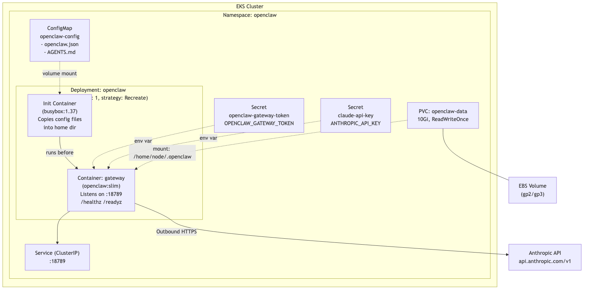

# Architecture: OpenClaw on AWS/Kubernetes

## Overview

OpenClaw runs as a single-pod deployment inside a dedicated `openclaw` namespace on an EKS cluster. The pod runs a gateway process that serves an HTTP API on port 18789, backed by persistent storage for conversation history and assistant state. Configuration is injected via a ConfigMap, and secrets (API keys, gateway token) are provided as Kubernetes Secrets.

## Diagram



The source for this diagram is in [assets/architecture.mmd](assets/architecture.mmd) and can be regenerated with:

```bash
npx @mermaid-js/mermaid-cli -i aws/assets/architecture.mmd -o aws/assets/architecture.png -b white --scale 2
```

## Components

### Pod structure

The deployment runs a single pod with two containers:

1. **Init container** (`busybox:1.37`) — copies `openclaw.json` and `AGENTS.md` from the ConfigMap into the persistent home directory at `/home/node/.openclaw/`. This runs once before the main container starts.

2. **Gateway container** (`ghcr.io/openclaw/openclaw:slim`) — the main OpenClaw process, running `node /app/dist/index.js gateway run`. It serves an HTTP API on port 18789 with token-based authentication.

The deployment uses `strategy: Recreate` because the pod mounts a ReadWriteOnce PVC, which cannot be attached to multiple nodes simultaneously.

### ConfigMap: `openclaw-config`

Contains two files:

- **`openclaw.json`** — gateway configuration: bind address, auth mode (token), agent definitions, model provider settings (Anthropic), and feature flags (Slack, cron disabled).
- **`AGENTS.md`** — agent instructions file copied into the workspace.

### Secrets

Two secrets are referenced as environment variables:

| Secret | Key | Purpose |
|---|---|---|
| `openclaw-gateway-token` | `OPENCLAW_GATEWAY_TOKEN` | Bearer token for authenticating to the gateway API |
| `claude-api-key` | `ANTHROPIC_API_KEY` | API key for Anthropic's Claude models |

These can be created manually, or via ExternalSecrets, Vault, SOPS, etc. See `secrets.yaml.example`.

### Service

A `ClusterIP` service exposes the gateway on port 18789 within the cluster. There is no Ingress configured — access is cluster-internal only. To expose externally, add an Ingress or LoadBalancer service.

### Storage

A 10Gi `PersistentVolumeClaim` (`openclaw-data`) is mounted at `/home/node/.openclaw`. This path is OpenClaw's home directory — it's where the application stores its configuration, conversation history, assistant state, and workspace files. Without persistent storage, all of this would be lost every time the pod restarts.

The mount path is `/home/node/.openclaw` specifically because the OpenClaw container image runs as the `node` user (UID 1000), and the application expects its data directory at `~/.openclaw`. The init container also writes configuration files (copied from the ConfigMap) into this directory before the gateway starts.

On EKS, the PVC defaults to a gp2/gp3 EBS volume.

## Security

The pod follows a hardened security posture:

- Runs as non-root (UID/GID 1000)
- Read-only root filesystem
- No privilege escalation
- All Linux capabilities dropped
- Seccomp profile: RuntimeDefault
- Service account token not mounted (`automountServiceAccountToken: false`)
- `/tmp` is an emptyDir (writable but ephemeral)

## Networking

- **Inbound**: ClusterIP service on port 18789 (cluster-internal only)
- **Outbound**: HTTPS to `api.anthropic.com/v1` for Claude API calls
- No Ingress is configured by default — the gateway is not exposed to the internet

## Current Limitations

- **Local access requires port-forwarding.** The gateway service is ClusterIP-only, so accessing OpenClaw from a local machine is not straightforward. You need to port-forward the service to localhost first:

  ```bash
  kubectl port-forward -n openclaw svc/openclaw 18789:18789
  ```

  Then access it at `http://localhost:18789`. There is no Ingress or LoadBalancer configured by default. Setting up proper external access (Ingress with TLS, ALB, etc.) is a future improvement.

## AWS Services

| Service | Usage |
|---|---|
| **EKS** | Kubernetes control plane and worker nodes |
| **EBS** | Persistent storage for the PVC (default gp2/gp3 storage class) |
| **ECR** (optional) | Can mirror `ghcr.io/openclaw/openclaw:slim` for faster pulls |
| **IAM** (optional) | IRSA (IAM Roles for Service Accounts) if using ExternalSecrets with AWS Secrets Manager |
